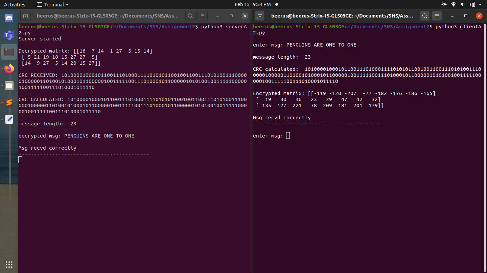

# System and Network Security (CS5470) - Lab Assignment 2

### EXTRA LIBRARIES REQUIRED
- numpy library

### COMMANDS
- start server ``` python3 serverA2.py ```
- start client ``` python3 clientA2.py```

### ASSUMPTIONS
- The server starts before client.
- Only client can send the messages.
- Only upper case alphabet and spaces will be given as input.

### WORKING
##### CLIENT SIDE
- Client connects to server on start and reads message from user
- ```calculateCRC()``` is called which converts number to binary, finds CRC using ```remainder()```  and returns it.
- Msg is encrypted using the standard given in the assignment by ```matrixEncrypt()```. It converts input msg to a length divisible by 3 by appending spaces at the end. After that messasge is converted to 3*N matrix (where N is determined by length of message).
- The 3*N matrix is then multiplied to A matrix for encryption by ```matmul()```.
- The CRC is appended to encrypted message separated by a colon for splitting at the server side and sent.
- Multiple clients are supported.

##### SERVER SIDE
- Server side dies the opposite job of the client. It splits message into CRC and encrypted matrix.
- It calculates decrypted matrix using ```matrixDecrypt()``` and also calculates CRC for decrypted message.
- Apropriate messages are printed depending on wether message was correctly received or not (Based on CRC calculation).

### Screenshot
 - 
